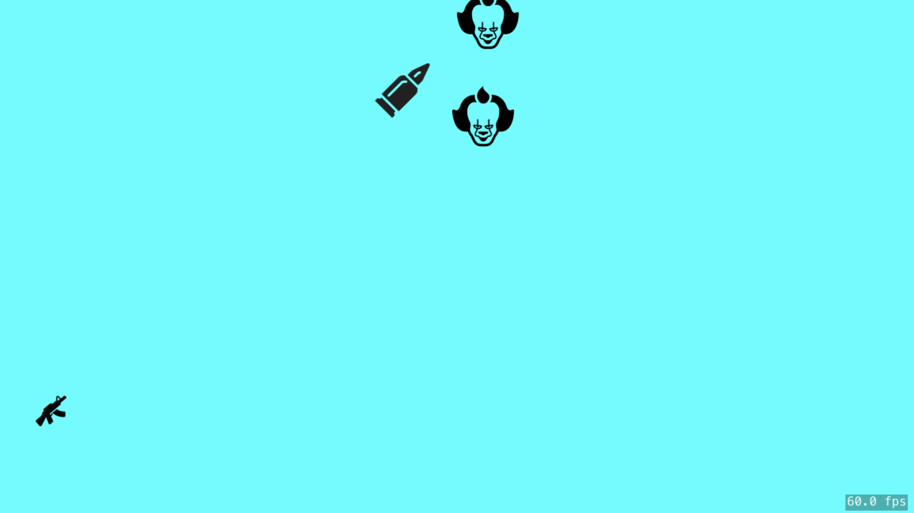

# Monster-Game-2D--Swift-Sprite-Kit
This Application is a 2D game development which is made for iOS platform. For developing this game I have used sprite kit which is high performing framework for developing 2D games in iOS.The Game play is simple and it is not tuff. So enjoy your game ;)

**Technologies:** Xcode, Swift, SpriteKit

## How it works (Pseudocode)
1. Application loads and play button has been displayed.
2. using ifelse statement multi player and single player option has been displayed after clicking appropriate function have been called and will run immediately 
3. using ifelse statement multi player and single player option has been displayed after clicking appropriate function have been called and runned during the game.
4.3 Sprites are used 
- Gun
- Bullets
- Monsters
5. The monsters comes continuously and rondomply as per the function.
6. The bullets shoost from the initial sprite (Gun) and are calculated from the starting point of the sprite as per the (x,y)
7. After the bullet hits the monster the collision is detected and effects are used
8. Back ground music is continuously played to make the game more entertaining.
9. after each collison cont function is used to update the final score at the end of the game.

# Production Screenshots:

## Start Screen

## Multiplayer or single Player Screen

## Speed Screen

## Choosing player Screen

## Collision effect

## Game Play Screen

## After winnig or loosing Screen

